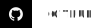

<h1 align=center> Esoteric Foundation </h1>

  

A small team of developers dedicated to creating high-quality software.

<table align="center">
  <tr>
    <td>⚙️</td>
    <td><b><a href="https://github.com/orgs/EsotericFoundation/repositories">Projects</a></b></td>
  </tr>
  <tr>
    <td>🌳</td>
    <td><a href="https://www.github.com/TheSlimySwamp">The Slimy Swamp</a></td>
  </tr>
  <tr>
    <td>⛏️</td>
    <td><a href="https://www.github.com/SlimeSMP">Slime SMP</a></td>
  </tr>
</table>

Unless stated otherwise, all of our software is licensed under the <a href="../assets/licenses/MIT License.md">MIT license</a> and all other works are licensed under the <a href="../assets/licenses/CC-BY-4.0 License.md">CC-BY-4.0 license</a>.

## 
✉️ Contact

|  | Work-in-progress                          |
| :----------------------------------------------------------------------------------------------------- | :---------------------------------------- |
|                    | <code>foundationesoteric@gmail.com</code> |

## 
🔗 Links

    
    
    

